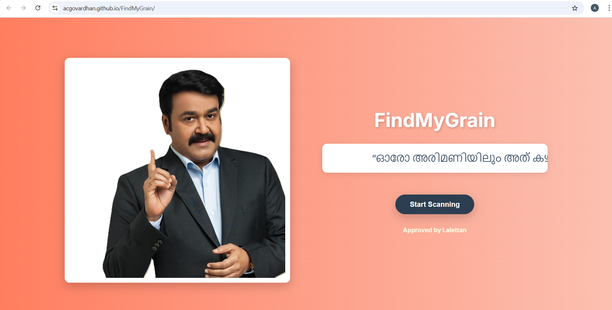
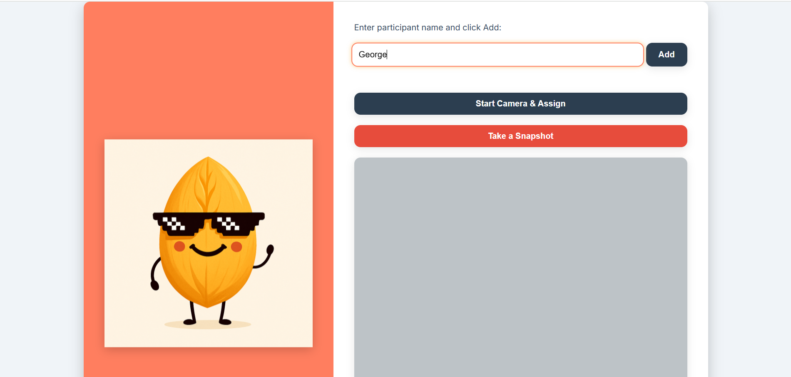
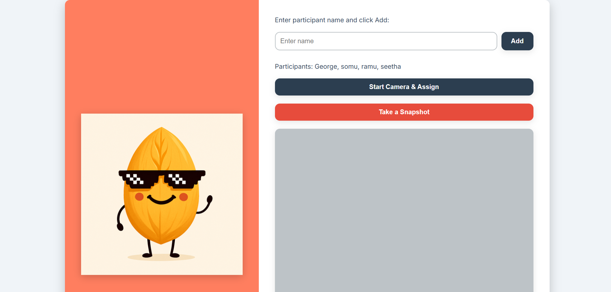
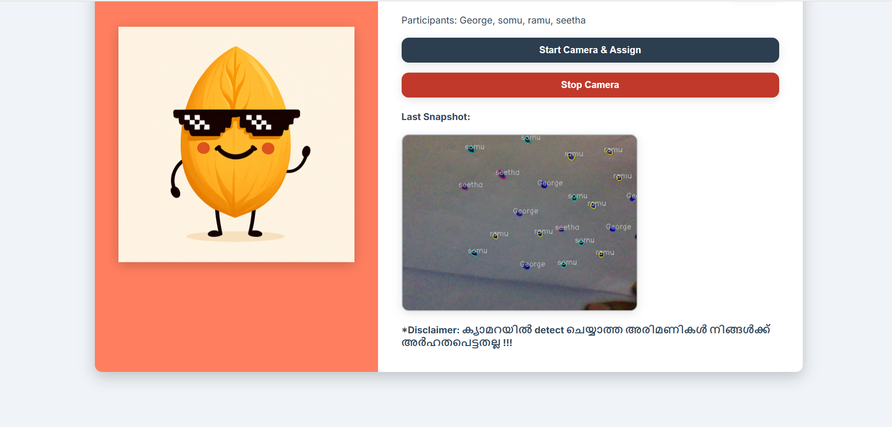
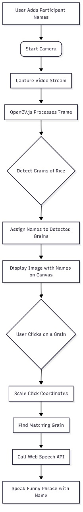

# FindMyGrain 🎯

## Basic Details
### Team Name: Void

### Team Members
- Team Lead: Aarya Tejaswini J - TKM College of Engineering, Kollam.
- Member 2: A C Govardhan - TKM College of Engineering, Kollam.

### Project Description
"Lalettan says, 'ഓരോ അരിമണിയിലും അത് കഴിക്കേണ്ടവന്റെ പേര് എഴുതിയിട്ടുണ്ട്' (Every grain of rice has the name of the person who should eat it). But how many of us know which is ours? We will help you find out!"

FindMyGrain is a fun and quirky web application built during the TinkerHub Useless Projects 2.0 hackathon to answer this profound question. Our project uses OpenCV.js to detect and assign names to individual grains of rice in real-time. The concept is simple: you and your friends can enter your names, point the camera at a small mound of rice, and our computer vision algorithm will randomly and equally distribute the grains among everyone. The true fun begins when you click on a grain using the Web Speech API, it will amusingly announce its assigned name, often with a humorous twist in it.

### The Problem (that doesn't exist)
You're eating your favorite biryani or mandi, but you can't shake the feeling that each grain of rice has a specific destiny. What if a grain meant for your friend accidentally ends up on your plate? This could lead to a cosmic imbalance and an unsatisfying meal.

### The Solution (that nobody asked for)
We're solving this crucial, world-ending problem with a web-based "Grain-Destiny-Decoder"! Our app uses your computer's camera and some "useless" computer vision magic to detect each grain, assign a participant's name to it, and even talk to you in a funny voice when you click on it. It’s like a personalized, talking fortune cookie for every grain of rice!

## Technical Details
### Technologies/Components Used
For Software:
- **Languages used:** HTML, CSS, JavaScript
- **Frameworks/Libraries used:** OpenCV.js (for computer vision), Web Speech API (for voice features)
- **Tools used:** Browser-based development environment

### Implementation
For Software:
# Installation
- Website is Deployed at the Link: [FindMyGrain](https://acgovardhan.github.io/FindMyGrain/).
- This is a browser-based application, so there is no installation required! Simply clone the repository and open `index.html` in your web browser.

# Run
1. Open the `index.html` file in a modern browser (like Chrome).
2. Enter the names of the participants.
3. Click "Start Camera".
4. Point the camera at the scattered grains of rice.
5. Watch the magic happen as each grain gets a name!
6. Click on a grain to hear it speak its owner's name.

### Project Documentation
For Software:

# Screenshots (Add at least 3)

*A screenshot showing the landing page.*

*A screenshot showing the main interface where participants can add their names.*

*This screenshot shows the participants added.*

*This screenshot shows the OpenCv Detection on a dummy input of black dots representing rice grains.*

# Diagrams

*This diagram illustrates the project's workflow, from user input to OpenCV detection and voice output.*

For Hardware:
*N/A - This is a software-only project.*

### Project Demo
# Video
[Add your demo video link here]
*This video demonstrates the full functionality of the FindMyGrain application, from adding participants to grain detection and the voice feature.*

# Additional Demos
[---]

## Team Contributions
- **A C Govardhan:** Implemented the computer vision logic for grain detection and tracking. Contributed to the front-end structure and functionality.
- **Aarya Tejaswini J:** Implemented the Web Speech API features, including the funny voice responses and multilingual support. Contributed to the front-end design, and wrote the project's README file.

---
Made with ❤️ at TinkerHub Useless Projects

